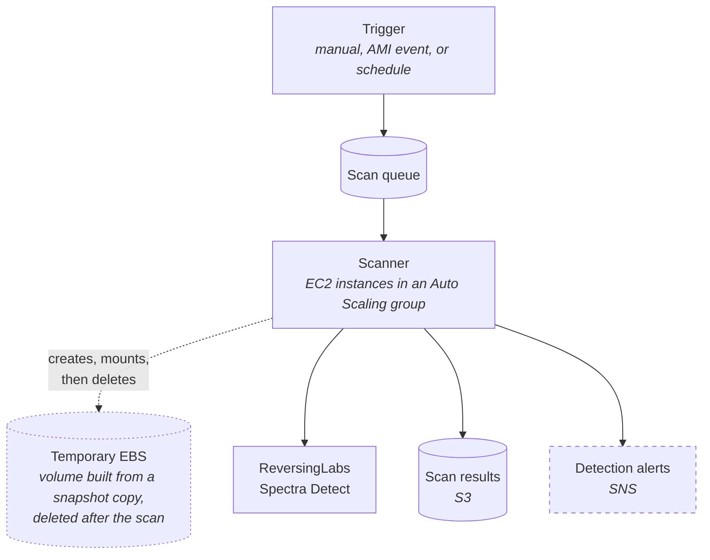

# AWS AMI Scanner - Deployment

Terraform for deploying the ReversingLabs AWS AMI Scanner.

**This repository contains the deployment templates only.** The scanner is
distributed as a machine image (AMI) -- there is no application source here.
You supply the AMI id; the terraform builds everything it needs to run around
it.

It scans an AMI, an EBS volume or an EBS snapshot, on EC2 capacity that scales
from zero. Scans start manually, when an AMI becomes available, or on a
schedule.

Start at [Setup](#setup).

Licensed under the MIT License; see [LICENSE](LICENSE).

## Architecture Overview



## Layout

| Path | What it is |
|---|---|
| [`aws/`](aws/README.md) | The stack. Start at "First deploy, start to finish". |
| [`modules/network/`](modules/network/) | VPC/subnet lookup, so those IDs are defined in one place. |

## What you need before starting

| What | Notes |
|---|---|
| The scanner AMI | Its id, for your region. Supplied by ReversingLabs; this repository does not build it. |
| A Spectra Detect endpoint | Its URL, and an API token. |
| A VPC and at least one subnet | Existing — the stack never creates one. How you lay it out is yours to decide; the scanner needs only to reach the AWS APIs and your Spectra Detect endpoint. |
| Terraform >= 1.9 | Earlier versions reject the variable validation this stack uses. |
| AWS credentials | Able to create IAM roles and instance profiles, EC2/Auto Scaling, SQS, S3, CloudWatch, EventBridge and Secrets Manager resources. |

## Setup

Four values must be set; everything else has a working default.

```hcl
# aws/terraform.tfvars
aws_profile           = "my-profile"
vpc_id                = "vpc-xxxxxxxxxxxxxxxxx"
subnet_ids            = ["subnet-xxxxxxxxxxxxxxxxx"]
reversinglabs_api_url = "https://spectra-detect.example.com"

scanner_ami_id = "ami-xxxxxxxxxxxxxxxxx"   # no scanner without it
```

Copy [`aws/terraform.tfvars.example`](aws/terraform.tfvars.example) to start.
`terraform.tfvars` is gitignored.

Leaving `scanner_ami_id` empty falls back to a stock Amazon Linux image, which
boots and joins the group but carries no scanner. The boot script fails loudly
rather than idling, so the failure is visible — but nothing will be scanned.

The API token is supplied separately so it stays out of the tfvars file:

```bash
cd aws
export TF_VAR_reversinglabs_api_token='<token>'

terraform init
terraform plan -out=tfplan     # review what will be created
terraform apply tfplan
```

Terraform puts the token in a Secrets Manager secret it creates. To reuse a
secret you already own, set `reversinglabs_api_token_secret_arn` instead.

Setting both, or neither, stops `terraform plan` before anything is created —
the scanner cannot authenticate without a token, and two sources means one of
them is wrong.

### Tag what you want scanned

The scanner only touches assets carrying **`RLScan=true`**. The key and value
are fixed, not configurable:

```bash
aws ec2 create-tags --resources ami-xxxxxxxxxxxxxxxxx --tags Key=RLScan,Value=true
```

An untagged asset comes back `skipped`. Naming one explicitly on the queue is
still subject to the gate.

One tag overrides it. An asset carrying **`scanner:managed=true`** is never
scanned, whatever else it is tagged with. That tag marks the scratch snapshots
and volumes the scanner creates for its own work: scanning one would re-scan a
copy of something already scanned, and on the volume path it would snapshot the
scratch volume, producing more scratch resources that are themselves scannable.
Do not put that tag on your own assets.

### Run the first scan

```bash
TRACE_ID=$(uuidgen)
aws sqs send-message \
  --queue-url "$(terraform output -raw scan_queue_url)" \
  --message-body "{\"type\":\"ami\",\"id\":\"ami-xxxxxxxxxxxxxxxxx\",\"trace_id\":\"$TRACE_ID\"}"
```

`type` is `ami`, `ec2-vol` or `snapshot`; `trace_id` must be a v4 UUID and
identifies the work item in the logs.

The fleet scales from zero on queue backlog, so the first scan of an idle
account waits for an instance to boot — several minutes longer than later ones.

Follow it, then collect the report:

```bash
aws logs tail "$(terraform output -raw cloudwatch_log_group)" --follow \
  --filter-pattern "\"$TRACE_ID\""

aws s3 ls "s3://$(terraform output -raw s3_results_bucket)/reports/" --recursive
```

The daemon logs `asset scan finished` with one of four outcomes: `complete`,
`partial`, `skipped` or `failed`.

### Then turn on automatic scanning

Both triggers are off by default, so applying the stack never silently starts
scanning. Enable either or both once a manual scan works:

```hcl
enable_eventbridge_trigger = true   # scan each AMI as it becomes available
enable_scan_schedule       = true   # sweep tagged assets on a schedule
```

[`aws/README.md`](aws/README.md) covers both in detail, along with IAM scoping,
privileges, troubleshooting and every variable.

## What a scan does

Nothing below is a step you run -- the daemon does all of it for one queued
asset. It copies the asset's snapshot, builds a temporary EBS volume from the
copy, attaches and mounts it read-only, walks the filesystem selecting files
according to the scan mode, uploads them to Spectra Detect, collects the
verdicts, writes the report, and deletes everything it created.

The copy is why a scan does not disturb the asset: the original snapshot is
never mounted, and a snapshot the scanner did not create is never deleted.

### Scan modes

The scan mode chooses **which directories are walked**. It is a path filter
and nothing more -- it never inspects file contents, so `binary-focused` does
not mean "files that are binaries". A shell script under `/usr/bin/` is
selected by it; a compiled executable under `/srv/` is not.

| Mode | Selects |
|------|---------|
| `binary-focused` | Executable paths only |
| `critical-paths` | Executable paths, plus configuration and credential locations |
| `full-filesystem` | Every file the filters do not exclude (default) |

Only these three are accepted. Any other value is rejected at startup rather
than substituted for a default, so a scan never runs under a mode other than
the one its report names.

Virtual filesystems (`/proc`, `/sys`, `/dev`, `/run`) are excluded before the
mode is consulted. No mode walks them.

### File filters

Filters run **after** the scan mode, against the files it selected, and they
are independent of it. A file is uploaded only if it passes both stages. So
the mode narrows *where* the scanner looks, and the filters narrow *what kind
of file* survives -- combining `binary-focused` with an `image` exclusion
means "executable paths, minus images", not one or the other.

Four filters apply, in this order. Exclusions are evaluated before
allowlists, so a file matching both is dropped:

| Filter | Effect |
|---|---|
| `exclude_mime` | Drop files whose MIME type contains any of these substrings |
| `exclude_categories` | Drop files in any of these categories |
| `include_mime` | If set, keep only files whose MIME type contains one of these substrings |
| `include_categories` | If set, keep only files in one of these categories |

MIME type is detected from magic bytes, not from the file extension, so a
`.txt` holding a JPEG is treated as an image. Detection is skipped entirely
when no MIME filter is configured.

The MIME substring tests are not anchored. `image/` selects `image/png`
because it is a substring of it, and would equally select a type that merely
contains `image/` later in the string.

**Setting both allowlists narrows twice.** `include_mime` and
`include_categories` are evaluated one after the other, so with both set a file
must satisfy both to survive -- the intersection, not the union. Setting
`include_categories` to `document` and `include_mime` to `application/zip`
keeps only files that are both, which for most filesystems is nothing at all.

#### Categories

Six category names are accepted. An unrecognised name is rejected at startup
rather than ignored: a typo in an exclusion would otherwise leave the intended
files scanned, and a typo in an allowlist would match nothing at all.

| Category | Covers |
|---|---|
| `image` | PNG, JPEG, GIF, WebP, BMP, TIFF, ICO, SVG |
| `audio` | MP3, FLAC, WAV, OGG, AAC |
| `video` | MP4, MKV, AVI, WebM, MOV |
| `font` | TTF, TTC, OTF |
| `archive` | ZIP, TAR, GZ, BZ2, ZST, 7Z, RAR, XZ |
| `document` | PDF, and legacy OLE2 Office files (DOC, XLS, PPT) |

Two caveats apply to category filtering:

- **Modern Office files (DOCX, XLSX, PPTX) count as `archive`, not
  `document`.** They are ZIP containers and are indistinguishable from a
  plain ZIP by magic bytes alone. Excluding `archive` therefore drops them
  too.
- **Filtering fails open.** If the MIME type cannot be determined, the file
  is uploaded rather than silently dropped. An exclusion is a reduction in
  scan volume, not a guarantee that no such file is ever sent.

#### Setting them

Each filter is a variable. The defaults leave every filter off, so a stack
applied without any of them scans `full-filesystem` with no MIME filtering --
and because no MIME filter is in force, no magic-byte detection runs either.

| Variable | Sets |
|---|---|
| `scan_mode` | Which directories are walked |
| `scan_exclude_categories` | Categories to drop |
| `scan_include_categories` | Categories to keep, dropping all others |
| `scan_exclude_mime` | MIME substrings to drop |
| `scan_include_mime` | MIME substrings to keep, dropping all others |
| `scan_exclude_paths` | Path patterns to skip |
| `scan_include_paths` | Paths to walk, narrowing the mode further |
| `scan_file_extensions` | Extensions to keep, without the leading dot, matched case-insensitively on the filename rather than the contents |
| `scan_max_files` | Cap on files uploaded per scan (0 = no cap) |
| `scan_max_file_size` | Largest file uploaded, in bytes (0 = no limit) |
| `scan_min_file_size` | Smallest file uploaded, in bytes |

A category or mode name the scanner does not know stops `terraform plan`,
rather than reaching an instance and being ignored there.

The filters reach an instance through the unit its user_data writes at boot, so
changing one takes effect on instances launched afterwards. Applying the change
creates a new launch template version and nothing else: the running fleet keeps
scanning with its old filters until those instances are replaced. Start an
instance refresh to apply it to the fleet now. While one is in progress both
sets are in force, and a single scan window can produce reports filtered two
ways.

#### Examples

Skip media and fonts, which are large relative to their analysis value, while
scanning everything else:

```hcl
scan_exclude_categories = ["image", "audio", "video", "font"]
```

Scan executables and libraries only, and drop archives so a large vendored
bundle does not dominate the upload:

```hcl
scan_mode               = "binary-focused"
scan_exclude_categories = ["archive"]
```

Look at documents and archives only, anywhere on the filesystem -- an
allowlist, so nothing else is uploaded:

```hcl
scan_include_categories = ["document", "archive"]
```

Exclude one specific type rather than a whole category, by MIME substring:

```hcl
scan_mode         = "critical-paths"
scan_exclude_mime = ["image/svg"]
```

Cap what one scan uploads, for a first run against an unfamiliar asset:

```hcl
scan_max_files     = 5000
scan_max_file_size = 104857600 # 100 MB
```

A capped scan that reaches its limit ends the walk early and the report records
it as truncated, so it is a sample of the asset rather than a full picture of
it.

## What this runs

Billable resources the stack creates or uses. What they cost depends on your
region, instance type and scan volume.

| Resource | When it exists |
|---|---|
| EC2 instances | While draining the scan queue. The group scales from zero, so an idle deployment runs none. |
| EC2 instance for dispatch | Seconds per scheduled run, then terminates. Only with `enable_scan_schedule`. |
| EBS snapshot copy and volume | Per scan. Both are deleted when it ends. |
| S3 | Reports and access logs, retained until you remove them. |
| CloudWatch Logs | Daemon output, retained 30 days by default. |
| SQS, Secrets Manager, SNS, EventBridge | Per queue message, stored secret and published notification. |

Data leaves the VPC when the scanner uploads files to Spectra Detect. Sizing
that is what `instance_type`, `asg_max_size` and the scan mode control.

## Security

- Never commit API tokens to version control
- Use AWS Secrets Manager for sensitive values
- Restrict IAM roles to minimum required permissions
- Enable CloudTrail for audit logging
- Use private subnets with NAT gateway for production

## Scan notifications (SNS)

When a topic is configured, the scanner publishes a JSON summary at the end of
**every** scan -- not only scans that found something. A clean result publishes
too, with `malicious_count` and `suspicious_count` at zero. That is deliberate:
if you only ever hear from the scanner when it finds something, you cannot tell
a quiet week from a scanner that stopped running.

To alert on detections alone, filter on the message body: the scanner sets no
SNS message attributes, so a subscription filter policy has to use
`FilterPolicyScope = "MessageBody"` and match `malicious_count`. Filtering in
whatever consumes the topic works equally well.

The message shares its keys and types with the JSON report; see
[Output envelope](#output-envelope) below for every field.

The notification carries counts and status, not file paths. To see which files
were flagged, read the report from S3; `expected_report_location` in the message
names where it should be.

### Supplying a topic

Two ways, mutually exclusive. Setting both stops `terraform plan` with:

```
create_sns_topic and sns_alert_topic_arn are mutually exclusive: either this
stack creates the topic or you supply an existing ARN, not both.
```

It fails rather than picking one because either choice could be the wrong one,
and the wrong one publishes to a topic nobody is subscribed to -- which looks
exactly like a scanner finding nothing.

**Let the stack create the topic:**

```hcl
create_sns_topic          = true
sns_subscription_protocol = "email"          # optional
sns_subscription_endpoint = "sec@example.com" # optional
```

The managed topic is encrypted, tagged with the stack's `common_tags`, and
carries a policy allowing publication only from principals in this account.
The scanner task role is granted `sns:Publish` on it.

**Or point at a topic you already own:**

```hcl
sns_alert_topic_arn = "arn:aws:sns:us-east-1:123456789012:my-topic"
```

The task role is granted `sns:Publish` on that ARN. Nothing else about the
topic — encryption, policy, subscriptions — is managed here.

Either way, `terraform output sns_alert_topic_arn` gives the topic actually in
play, so you can attach a subscription without reading state.

### Encryption

`sns_topic_kms_master_key_id` defaults to `alias/aws/sns`, the AWS-managed key.
Encryption is not optional: the notification names malicious paths inside the
AMI you scanned, so the message body *is* the finding.

Supply a customer-managed key ARN if you need cross-account subscribers (the
AWS-managed key does not permit them) or your own rotation policy. The task
role is then also granted `kms:GenerateDataKey` and `kms:Decrypt` on that key —
without them `Publish` fails at runtime with a KMS `AccessDenied`, after a scan
has already completed, and nowhere near plan time.

### If notifications never arrive

An email subscription is **pending until the recipient clicks the confirmation
link**. Terraform cannot observe that and reports the subscription as created
either way, so a silent pipeline is more often an unconfirmed subscription than
a broken scanner. Check `aws sns list-subscriptions-by-topic`: a pending one has
`"SubscriptionArn": "PendingConfirmation"`.

Note also that the tag policy denies an untagged `sns:CreateTopic` with a bare
`AccessDenied` that names the action rather than the missing tag — which reads
exactly like a missing IAM permission. The managed topic is tagged; a topic you
create by hand needs the same six tags.

## Output envelope

The scanner emits each scan through two channels: a JSON report (written
locally, optionally uploaded to S3) and an SNS notification. Both are
stable contracts you can integrate against: the fields below use the same key
name and JSON type in each.

Per-file shape (`malicious_files[]` / `suspicious_files[]`) is not part of this
envelope.

Both outputs carry `schema_version`, currently **`2.3.0`**. It versions the
document shape, not the scanner build; build provenance lives in the report's
`metadata` map.

### Shared fields

The report nests these (`result.*`, `completeness.*`); the SNS message is flat.

| key | JSON type | report path | notes |
|---|---|---|---|
| `schema_version` | string | `schema_version` | same constant in both |
| `resource_id` | string | `result.resource_id` | the scanned asset |
| `region` | string | `result.region` | |
| `account_id` | string | `result.account_id` | routes a multi-account alert |
| `scan_time` | string (RFC3339 UTC) | — | |
| `total_files` | number | `result.total_files` | |
| `malicious_count` | number | `result.malicious_count` | |
| `suspicious_count` | number | `result.suspicious_count` | |
| `error_count` | number | `result.error_count` | |
| `status` | string | `completeness.status` | `complete` / `partial` / `failed` |
| `files_discovered` | number | `completeness.files_discovered` | with `total_files`, gives coverage from SNS alone |
| `files_analyzed` | number | `completeness.files_analyzed` | |
| `files_errored` | number | `completeness.files_errored` | |
| `files_skipped` | number | `completeness.files_skipped` | |
| `failure_reason` | string | `completeness.failure_reason` | empty means no failure |
| `anomaly_count` | number | `len(completeness.anomalies)` | a scalar in SNS where the report has a list |

An anomaly means something went wrong during analysis itself, so the verdicts
that were produced are suspect rather than merely incomplete -- a filesystem
walk that failed partway, a spill file that could not be written or closed, or
an unexpected failure inside the analysis pipeline. Any anomaly forces `status`
to `partial`. The count travels to SNS so you can decide to re-scan without
fetching the report; the detail stays in the report.

### Example

A completed scan of an AMI. Identifiers are placeholders; the account id is the
AWS documentation example.

**The report**, at `s3://<bucket>/reports/<resource-id>/<timestamp>.json`:

```json
{
  "schema_version": "2.3.0",
  "generated_at": "2026-09-21T13:44:04.760783097Z",
  "result": {
    "resource_id": "ami-xxxxxxxxxxxxxxxxx",
    "region": "us-east-1",
    "account_id": "123456789012",
    "start_time": "2026-09-21T13:18:55.560877748Z",
    "end_time": "2026-09-21T13:44:04.760783097Z",
    "duration_seconds": 1509.199905356,
    "duration_human": "25m9.199905356s",
    "scan_mode": "full-filesystem",
    "total_files": 39090,
    "malicious_count": 0,
    "suspicious_count": 0,
    "clean_count": 19434,
    "unknown_count": 19656,
    "error_count": 0
  },
  "summary": {
    "total_size": 0,
    "malicious_files": [],
    "suspicious_files": []
  },
  "metadata": {
    "account_id": "123456789012",
    "asset_type": "ami",
    "attempt_id": "9b2c7e10f4a6d382",
    "availability_zone": "us-east-1c",
    "filesystem_type": "xfs",
    "instance_id": "i-xxxxxxxxxxxxxxxxx",
    "instance_image_id": "ami-yyyyyyyyyyyyyyyyy",
    "mount_root": "/mnt/ami-scan/snap-xxxxxxxxxxxxxxxxx-pid1234-abcd1234",
    "mounted_device": "/dev/nvme1n1p1",
    "region": "us-east-1",
    "resource_id": "ami-xxxxxxxxxxxxxxxxx",
    "scan_mode": "full-filesystem",
    "scanner_build_date": "2026-09-17T16:41:04Z",
    "scanner_commit": "a1b2c3d",
    "scanner_version": "v1.2.0",
    "snapshot_id": "snap-xxxxxxxxxxxxxxxxx",
    "trace_id": "3f8a1c20-5d4e-4b7a-9c31-0e2f6a8b4d55",
    "volume_id": "vol-xxxxxxxxxxxxxxxxx"
  },
  "completeness": {
    "status": "complete",
    "files_discovered": 43826,
    "files_analyzed": 39090,
    "files_errored": 0,
    "files_skipped": 4736
  }
}
```

`files_discovered` exceeds `files_analyzed` because the scan mode and the size
and type filters exclude files before analysis; the difference is
`files_skipped`. `unknown_count` counts files Spectra Detect returned no
classification for.

**The SNS message** for the same scan — flat, and a projection of the above:

```json
{
  "schema_version": "2.3.0",
  "resource_id": "ami-xxxxxxxxxxxxxxxxx",
  "region": "us-east-1",
  "account_id": "123456789012",
  "scan_time": "2026-09-21T13:44:04Z",
  "total_files": 39090,
  "malicious_count": 0,
  "suspicious_count": 0,
  "error_count": 0,
  "scanner_version": "v1.2.0",
  "status": "complete",
  "files_discovered": 43826,
  "files_analyzed": 39090,
  "files_errored": 0,
  "files_skipped": 4736,
  "anomaly_count": 0,
  "expected_report_location": "s3://<bucket>/reports/ami-xxxxxxxxxxxxxxxxx/20260921T134404Z.json"
}
```

Note `scan_time` is second-precision RFC3339 where the report's `generated_at`
carries nanoseconds -- the same instant, formatted for a flat notification.
`metadata` is absent by design -- reacting to a notification should not require
parsing a free-form map. `scanner_version` is the one key lifted out of it: a
verdict of zero from a build with a known detection gap is a different claim
from the same number out of a current build, and triage cannot wait on
fetching the report to tell them apart. It is omitted on a binary carrying no
injected build provenance, rather than sent as an empty or placeholder
version.

### Provenance

The report's `metadata` map answers two questions, and the keys are additive
rather than alternatives.

**Where the scan ran.** `instance_id`, `instance_image_id` and
`availability_zone` come from instance metadata and describe the scanner host.
`instance_image_id` is the AMI the **host** booted from -- not the AMI under
scan, which is `resource_id`. Above, the host booted `ami-yyyy...` and scanned
`ami-xxxx...`. All are absent off EC2.

**Which work item it was.** `trace_id` is minted when the asset is enqueued and
stays stable across redeliveries, so it identifies the work item; `attempt_id`
is minted per execution. Both are needed: with only `trace_id`, a retry cannot
be told from its original; with only `attempt_id`, a report cannot be joined
back to the message that caused it. Both are absent on the CLI paths, which
have no queue behind them.

`scanner_version`, `scanner_commit` and `scanner_build_date` identify the build
that produced the report. They are omitted entirely if the binary was not
stamped at build time, rather than reported as `dev` or `unknown`.

The remaining keys describe the scan itself: `snapshot_id` and `volume_id` are
the scratch resources created and then deleted, `mounted_device` and
`mount_root` where the filesystem was attached, `filesystem_type` what was
found there.

### Two rules to integrate against

**Absent, never placeheld.** A field whose value is unknown is omitted, never
emitted as `""`, `dev` or `unknown`. A malformed value is dropped rather than
rewritten — a sanitized id would name a resource that does not exist, and
nothing in the output would reveal that. Treat every `metadata` key as
optional.

**Zero is a value.** No numeric field uses `omitempty`. A scan that analyzed
nothing emits `"files_analyzed": 0`, because "0 malicious found" and "field
absent" must not look alike. `schema_version` is the only producer-generation
signal.

### Report-only fields

Present in the report, absent from SNS:

| field | why |
|---|---|
| `result.clean_count`, `result.unknown_count` | derivable; not actionable in a notification |
| `result.scan_mode` | describes how the scan ran, not what it found |
| `result.start_time`, `end_time`, `duration_*` | `scan_time` is the one time a notification needs |
| `summary.total_size` | volumetric detail, not a signal |
| `summary.malicious_files[]`, `suspicious_files[]` | per-file notification is a separate feature |
| `completeness.reasons` | diagnostics histogram |
| `metadata` | free-form map; reacting to a notification should not need it |

### SNS-only fields

`expected_report_location` is the S3 URI the report **would** be written to,
computed from the same inputs rather than read back from the upload. It can
therefore name an object that does not exist — treat a 404 as normal, and not
as proof the report was stored. Omitted when no S3 bucket is configured.
